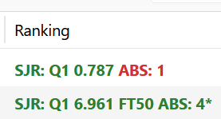
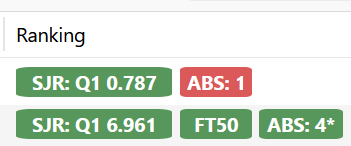

# Publication Rankings for Zotero 9

[](https://github.com/macvirii/zotero-publication-rankings/releases/latest) [](https://github.com/macvirii/zotero-publication-rankings/releases) [](https://www.gnu.org/licenses/gpl-3.0)

A Zotero plugin that automatically displays journal and conference rankings in a custom column in your Zotero library.

This fork has been validated only on Zotero 9.

## Fork Notice

This repository is a maintained fork of [ben-AI-cybersec/zotero-publication-rankings](https://github.com/ben-AI-cybersec/zotero-publication-rankings).

This fork is published as an updated version with additional ranking data sources, Zotero compatibility updates, performance improvements, and a broader dataset for Brazilian/CAPES-oriented journal evaluation workflows.

The original project, copyright notices, and GPLv3 license are preserved. Changes in this fork are maintained independently and should not imply endorsement by the original author.

### AI-Assisted Migration And Maintenance

Parts of this fork were migrated, refactored, and documented with AI assistance. AI was used to help inspect the existing codebase, update compatibility, add ranking sources, generate extraction scripts, improve performance, and organize documentation. Final decisions, dataset choices, review, testing, and publication of this fork remain the responsibility of the fork maintainer.

### Fork Maintenance Practices

- Upstream attribution is preserved in the README, source headers, and license.
- Fork-specific changes are documented in the changelog and committed separately where practical.
- The fork uses its own releases and issue tracker for fork-specific support.
- Data source provenance is documented, and generated ranking datasets are kept reproducible through `update-scripts/` when source data is available.
- Compatibility and behavior changes are versioned independently from the upstream repository.

## Features

- **Custom "Ranking" Column**: See rankings at a glance without modifying your metadata
- **SJR Journal Rankings**: 30,818+ journals with quartiles (Q1-Q4) and SJR scores
- **CORE Conference Rankings**: 2,173+ conferences (A*, A, B, C) with historical editions
- **ABS Rankings**: 1,822 journals
- **ABDC Rankings**: 2,651 journals from the Australian Business Deans Council Journal Quality List
- **Qualis CAPES 2021-2024**: 32,195+ journal titles from the official CAPES spreadsheet, using the best stratum across areas
- **Nova Classificacao CAPES**: Local rule-based Area 27 classification (MB, B, R, F, I) using ABDC, ABS, SJR, SPELL, SciELO, and optional local JCR data when provided
- **SPELL Impact Rankings**: 111 Brazilian journals grouped by impact percentile band
- **FT50 Rankings**: 50 journals
- **Color-Coded Display**: Green (Q1/A*) → Blue (Q2/A) → Orange (Q3/B) → Red (Q4/C)


- **Badge Display**: 


- **Smart Matching**: Exact, ISSN, normalized-title, fuzzy, word-overlap, substring, and acronym strategies handle title variations across databases
- **Automatic Updates**: Rankings appear when items are added or viewed
- **Sortable Column**: Click column header to sort by ranking tier (A* → Q4)
- **Context Menu Integration**: Right-click items for quick ranking operations
- **Debug Matching**: Detailed logging to troubleshoot matching issues
- **Manual Override**: Set custom rankings for incorrectly matched journals
- **Persistent Storage**: Manual overrides and preferences survive Zotero restarts
- **Extra Field Integration**: Write rankings to Zotero's Extra field for export
- **Batch Operations**: Efficient batch processing with progress tracking
- **Smart Cleanup**: Automatically removes ranking entries when plugin is disabled

## Installation

1. Download the latest `publication-rankings-*.xpi` from the [fork releases page](https://github.com/macvirii/zotero-publication-rankings/releases/latest)
2. In Zotero: Tools → Add-ons → ⚙️ → "Install Add-on From File..."
3. Select the `.xpi` file and restart Zotero
4. Right-click column headers and enable the "Ranking" column

## Usage

Rankings automatically appear in the Ranking column when you view items.

### Check Rankings

To see statistics about ranking matches for selected items:
1. Select one or more items in your library
2. Right-click → "Check Publication Rankings" (or Tools → "Check Publication Rankings")
3. A dialog shows how many rankings were found/not found

### Debug Matching

If rankings aren't appearing correctly:
1. Select items to debug
2. Right-click → "Debug Ranking Match"
3. Open Help → Debug Output Logging → View Output
4. Look for lines starting with `[MATCH DEBUG]` showing:
   - Matching strategies attempted (exact, fuzzy, word overlap, CORE)
   - Match percentages and which database was used
   - Final ranking result or why no match was found

### Manual Ranking Override

For incorrectly matched journals or unmatched publications:
1. Select items from the same publication
2. Right-click → "Set Manual Ranking..."
3. Enter ranking (e.g., "A*", "Q1", "B", "C", "Au A", "Nat B")
4. The ranking column updates immediately

To remove a manual override:
1. Select items
2. Right-click → "Clear Manual Ranking"
3. Rankings revert to automatic matching

**Note**: Manual overrides are stored persistently and survive Zotero restarts.

### Extra Field Integration

Write rankings to Zotero's Extra field for export or sharing with others:

1. Select items in your library
2. Right-click → "Write Rankings to Extra Field" (or Tools menu)
3. Rankings are added in the format: `Ranking: Q1 0.85 (SJR)` or `Ranking: A* (CORE)`
4. Progress window shows how many items were updated

**Features:**
- Preserves existing Extra field data (citations, BBT keys, etc.)
- Batch processing with single database transaction

### Sorting by Ranking

Click the "Ranking" column header to sort items by ranking tier:
- **Ascending**: Best (A*) → Worst (Unranked)
- **Descending**: Worst (Unranked) → Best (A*)

The sort order groups stronger rankings first across enabled sources, including A*/A/B/C, Q1-Q4, CAPES A1-C, Nova CAPES MB-I, SPELL percentile bands, FT50, national CORE labels, and unranked items.

## Preferences

Access via Edit → Preferences (Zotero → Settings on Mac), then select "Rankings":

### Ranking Databases
- **SJR (SCImago Journal Rankings)**: Always enabled - 30,818+ journals
- **CORE (Computing Research & Education)**: Toggleable - 2,173+ conferences
- **ABS Rankings***: Toggleable - 1,822 journals
- **ABDC Rankings***: Toggleable - 2,651 journals
- **Qualis CAPES 2021-2024***: Toggleable - 32,195+ journal titles
- **Nova Classificacao CAPES***: Toggleable - calculated locally from available sources
- **SPELL Impact Rankings***: Toggleable - 111 journals
- **FT50 Rankings***: Toggleable - 50 journals

### Auto-Update Settings
- **Enable auto-update**: Automatically refresh rankings when viewing items

### User Interface
- **Use Badges**: Show colored badges instead of colored text

### Extra Field Integration
- Use the Tools or context menu action to write current rankings into selected items' Extra fields

### Developer Options
- **Debug logging**: Enable detailed matching diagnostics in Debug Output

## Building from Source

### Prerequisites
- Python 3.x for data extraction scripts
- PowerShell for Windows builds or Bash plus `zip`, `7z`, `jar`, or Python's `zipfile` module for Linux/macOS builds

### Updating Rankings Data

When new rankings are released:

```bash
cd update-scripts

# Step 1: Extract SJR rankings (from scimagojr CSV)
python extract_sjr.py

# Step 2: Extract CORE rankings (from full_CORE.csv with historical data)
python extract_full_core.py

# Step 3: Extract ABS rankings (from source-data/ABSRanking2024_Fulllist.csv)
python extract_abs.py source-data/ABSRanking2024_Fulllist.csv

# Step 4: Extract ABDC rankings (from source-data/ABDC-JQL-2025-v1-260326.xlsx)
python extract_abdc.py source-data/ABDC-JQL-2025-v1-260326.xlsx

# Step 5: Extract Qualis CAPES rankings (from source-data/CAPES XLSX)
python extract_qualis_capes.py source-data/classificações_publicadas_todas_as_areas_avaliacao1768259646562.xlsx

# Step 6: Extract SPELL and SciELO supporting datasets
python extract_spell.py
python extract_scielo.py

# Step 7: Extract FT50 rankings (from source-data/FT50_FullList.csv)
python extract_ft_50.py source-data/FT50_FullList.csv

# Step 8: Combine into plugin data file
python generate_data_js.py
```

This generates `src/data/data.js` from the JSON files in `update-scripts/`.

### Building the Plugin

```powershell
cd zotero-publication-rankings
.\build.ps1
```

```bash
cd zotero-publication-rankings
./build.sh
```

This creates the `.xpi` file ready for installation (e.g., `dist/publication-rankings-0.3.3.xpi`).

## Project Structure

```
zotero-publication-rankings/
├── assets/                         # Screenshots used by README
├── dist/                           # Local build output; ignored by git
├── src/
│   ├── actions/                    # User-triggered operations and overrides
│   ├── core/                       # Plugin coordinator, hooks, preferences
│   ├── data/                       # Generated runtime ranking data
│   │   └── data.js
│   ├── databases/                  # Database adapters registered with DatabaseRegistry
│   │   ├── database-abs.js
│   │   ├── database-abdc.js
│   │   ├── database-capes-nova.js
│   │   ├── database-core.js
│   │   ├── database-ft-50.js
│   │   ├── database-qualis-capes.js
│   │   ├── database-registry.js
│   │   ├── database-sjr.js
│   │   └── database-spell.js
│   ├── engine/                     # Ranking orchestration and matching utilities
│   └── ui/                         # Column, menu, window, badge, color, and sort UI code
├── update-scripts/
│   ├── source-data/                # CSV/XLSX input datasets
│   ├── *_rankings.json             # Generated intermediate ranking datasets
│   ├── extract_*.py                # Source-data extractors
│   ├── generate_data_js.py         # Combines intermediate JSON into src/data/data.js
│   └── xlsx_utils.py               # Minimal XLSX reader used by extractors
├── bootstrap.js                    # Zotero bootstrap lifecycle and module loading
├── build.ps1                       # Windows build script; writes dist/*.xpi
├── build.sh                        # Bash build script; writes dist/*.xpi
├── CHANGELOG.md
├── INSTALL.md
├── LICENSE
├── logo.svg
├── manifest.json
├── preferences.xhtml
├── prefs.js
├── README.md
└── updates.json                    # Zotero update manifest
```

**Note**: The build process copies files from `src/` directories and flattens them to the XPI root.

### Modular Architecture

The plugin uses an extensible modular architecture designed for maintainability and future growth:

#### Core System
- **`bootstrap.js`** - Plugin lifecycle management, loads modules in dependency order
- **`rankings.js`** - Main coordinator, delegates to specialized modules
- **`hooks.js`** - Zotero lifecycle event handlers (notifier, item observers)
- **`prefs-utils.js`** - Preference storage wrapper with observer pattern

#### Data Layer
- **`data.js`** - Ranking databases
  - `sjrRankings`: 30,818 journals with quartiles (Q1-Q4) and SJR scores
  - `coreRankings`: 2,173 conferences with tiers (A*, A, B, C) and historical editions
  - `absRankings`: 1,822 journals with ranking (1, 2, 3, 4, 4*)
  - `abdcRankings`: 2,651 journals with ABDC quality ratings (A*, A, B, C)
  - `qualisCapes2021Rankings`: official Qualis CAPES 2021-2024 strata
  - `spellRankings`: SPELL impact percentile bands
  - `scieloRankings`: current SciELO Brasil journal list
  - `jcrRankings`: optional local input for Nova CAPES calculation; empty when no local dataset is provided
  - `ft50Rankings`: 50 journals

#### Database Registry System
- **`database-registry.js`** - Central registry for all ranking databases
  - Uniform plugin API: `register({ id, name, prefKey, priority, matcher })`
  - Priority-based ordering across all enabled ranking sources
  - Generic enable/disable support for all databases
- **`database-sjr.js`** - SJR matching strategies
  - ISSN, exact, fuzzy, and word-overlap matching for journal titles
- **`database-core.js`** - CORE conference matching
  - 5-strategy matching: exact → substring → word overlap → acronym → year-flexible
  - Delegates to `MatchingUtils` for algorithm implementation

#### Ranking Engine
- **`ranking-engine.js`** - Core ranking retrieval
  - Loops through enabled databases via `DatabaseRegistry.getEnabledDatabases()`
  - No hardcoded database logic - fully extensible
  - Extracts publication titles from Zotero items
- **`matching.js`** - String normalization and matching algorithms
  - Exported as `MatchingUtils` global object
  - Shared utilities for all database plugins

#### User Interface
- **`column-manager.js`** - Custom column registration and display
  - Column data provider with caching
  - Cell rendering with color coding
- **`menu-manager.js`** - Context menu and Tools menu integration
  - Item-level and collection-level operations
  - Dynamic menu item creation per window
- **`window-manager.js`** - Window lifecycle tracking
  - Manages multiple Zotero windows
  - Cleanup on window close
- **`ui-utils.js`** - UI formatting helpers
  - Color coding: Green (A*/Q1) → Blue (A/Q2) → Orange (B/Q3) → Red (C/Q4)
  - Sort value calculation for proper tier ordering

#### User Actions
- **`ranking-actions.js`** - User-triggered operations
  - Batch ranking updates for selected items with progress tracking
  - Extra field integration: `writeRankingsToExtra()` and `updateRankingsInExtra()`
  - Automatic cleanup: `cleanupAllRankingsFromExtra()` on plugin disable
  - Debug matching with detailed logging
  - Manual ranking override dialog
- **`overrides.js`** - Manual override persistence
  - Stored in Zotero preferences
  - Exported as `ManualOverrides` global object

#### Extensibility
Adding new ranking databases requires minimal core logic changes:
1. Create `src/databases/database-xxx.js` with a matcher that accepts the normalized title, debug logger, and Zotero item when needed
2. Register with `DatabaseRegistry.register({ id, matcher, ... })`
3. Add preference in `preferences.xhtml`
4. The generic `handleDatabaseChange()` automatically supports the new database

The build scripts copy these source modules into the XPI root in the order required by `bootstrap.js`.

## Data Sources

- **SJR 2024**: [SCImago Journal & Country Rank](https://www.scimagojr.com/)
- **CORE 2023**: [Computing Research and Education](http://portal.core.edu.au/conf-ranks/)
- **ABS 2024**: [ABS Ranking](https://journalranking.org)
- **ABDC 2025**: [ABDC Journal Quality List](https://abdc.edu.au/abdc-journal-quality-list/)
- **Qualis CAPES 2021-2024**: Official CAPES XLSX spreadsheet included in this fork's source tree
- **Nova Classificacao CAPES 2025-2028**: Local implementation of the Area 27 methodology described by [periodicos-adm.com](https://periodicos-adm.com/sobre)
- **SPELL 2024**: [SPELL Impacto de Periodicos](https://www.spell.org.br/impacto)
- **SciELO Brasil**: [Current SciELO Brasil journals](https://www.scielo.br/journals/alpha?status=current)
- **JCR**: Not bundled or displayed as a standalone source; `generate_data_js.py` can include a local `jcr_rankings.json` as an optional Nova CAPES input
- **FT50**: [FT50 Ranking](https://www.ft.com/content/3405a512-5cbb-11e1-8f1f-00144feabdc0)

## License

This project is licensed under the GNU General Public License v3.0 (GPLv3).
See the [LICENSE](LICENSE) file for details.

## Authors And Maintainers

- Original project: **Ben Stephens**
- Fork maintainer: **macvirii**

## Contributing

Contributions to this fork are welcome. Please open pull requests against [macvirii/zotero-publication-rankings](https://github.com/macvirii/zotero-publication-rankings).

For changes that are generally useful to all users, consider whether they should also be proposed upstream to the original project.

## Support

If you encounter issues with this fork or have suggestions for the added data sources, please open an issue on the [fork repository](https://github.com/macvirii/zotero-publication-rankings/issues).
